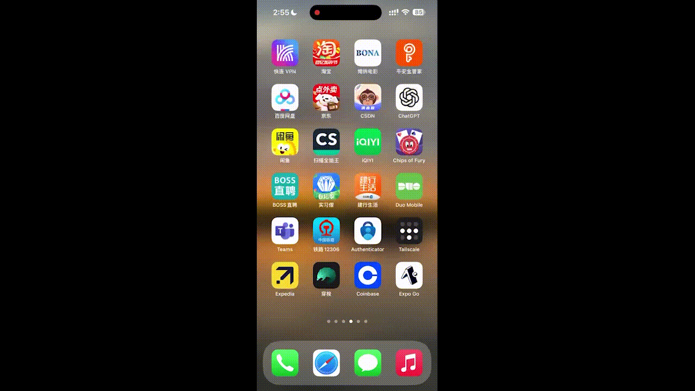
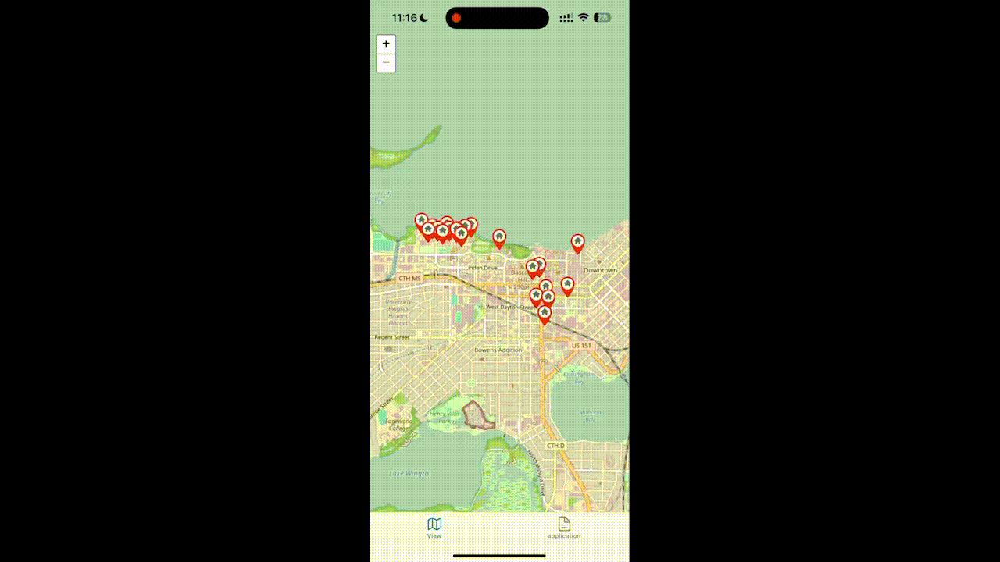
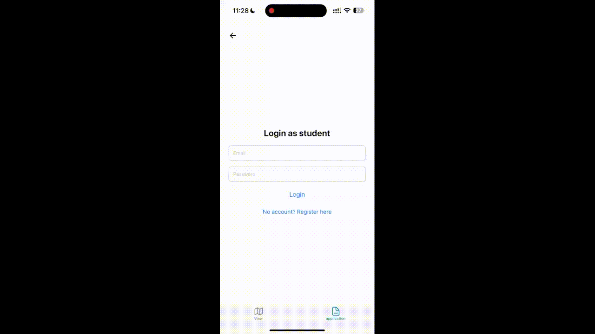
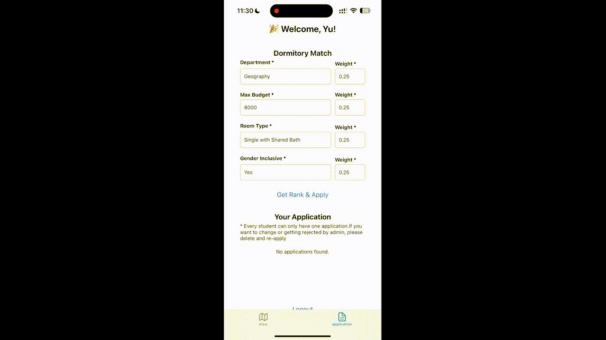
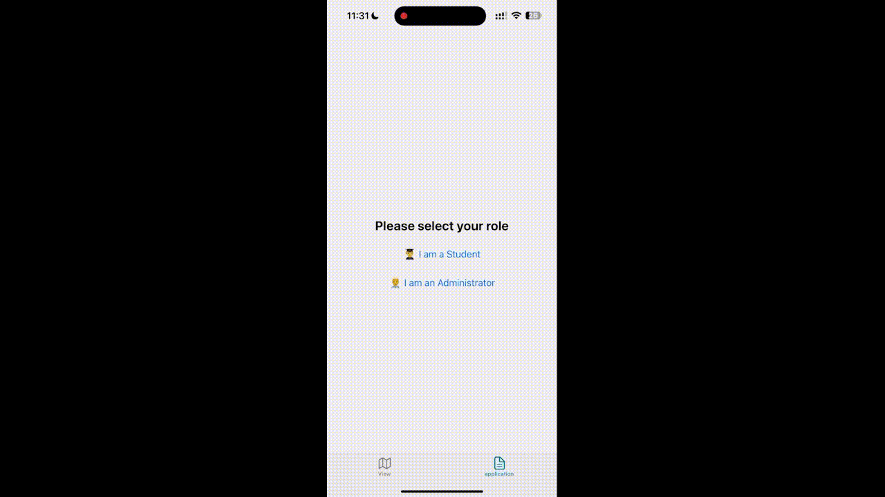

# UWM Dormitory Application System

> This application is intended for **mobile devices only** (iOS & Android).

## Overview

This app is designed to help manage dormitory and applicant information for the University of Wisconsin–Madison (UWM). It aims to **reduce the time students spend searching for suitable dormitories** by streamlining the application and review process.

-  **Students** can register, log in, and apply for dormitories based on their preferences.
-  **Administrators** can review applications and either **accept** or **reject** them.

---

## How to Use

### Backend & Database

The backend and database are already deployed on the cloud — **you do not need to download them locally**.

### Frontend (Expo-based)

1.  Install the [Expo Go app](https://expo.dev/client) on your mobile device.

2.  Clone the repository:

```bash
git clone https://github.com/anfjbajfa/finial_project.git
cd dorm-assignment-app
npm install
npm start
```

3.  After starting the project, you will see a QR code in your terminal or browser.

4.  **Scan the QR code with Expo Go** (supports both iOS and Android).

5.  If scanning fails, you may need to **configure your firewall** to allow Expo through.

> Once the app runs, you can try registering and logging in — you may use **any random data** during registration; there are no validation restrictions. However, please make sure the backend service is **running and accessible**, as it is hosted with a **4-hour time limit per session**.

---

### Admin Credentials

To view existing applications as an admin:

- **Email:** fan246@wisc.edu
- **Password:** 123

---

## Demo GIFs

Below are some core features demonstrated as GIFs:

### Student Side

- **View Dorm Info**

  

- **Registration**

  

- **Student Login**

  

- **Get Dorm Rankings**

  

### Admin Side

- **Admin Login**

  

---

Enjoy testing the app
